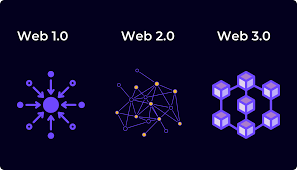
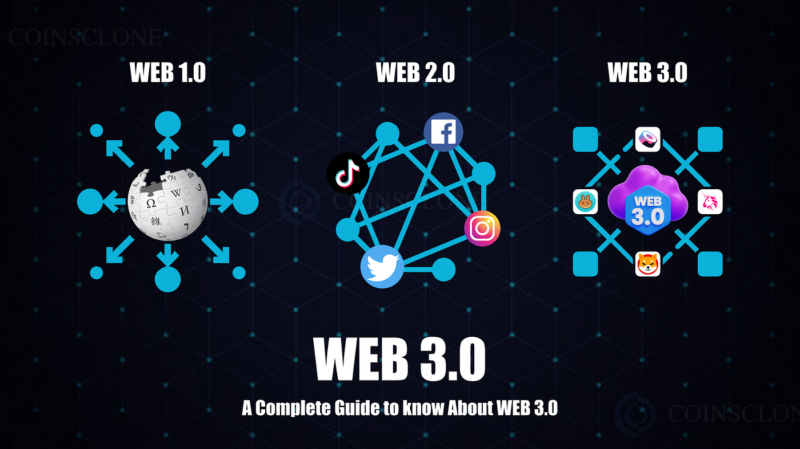
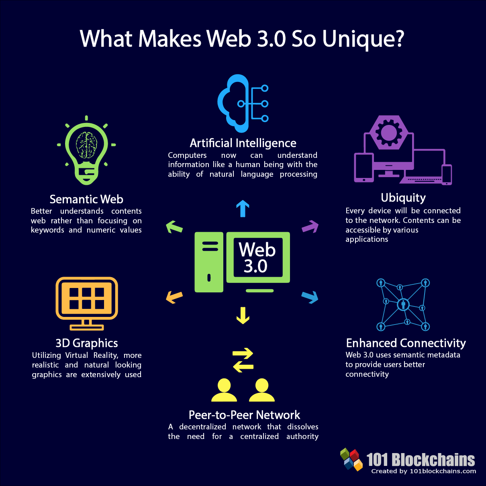

<h1>Central Advanced Research & Development</h1>


  

**Languages and Tools:**  

<code></code>
<code></code>
<code></code>
<code></code>
<code></code>
<code></code>
<code></code>
<code></code>
<code></code>
<code></code>
<code></code>
<code></code>
<code></code>

📊 **This week i spent my time on:**
<!--START_SECTION:waka-->

```txt
PHP          6 hrs           █████████████░░░░░░░░░░░░  50.00 %
JavaScript   6 hrs           █████████████░░░░░░░░░░░░  50.00 %
```

<!--END_SECTION:waka-->
  
- 💼 any freelance work? do reach, [email](mailto:weidhe.card@gmail.com) :)
- 💬 ask me about anything, i am happy to help;

🚧 **My todolist stats:**
<!-- TODO-IST:START -->
🏆  1,000 Karma Points           
🌸  Completed 0 tasks today           
✅  Completed 100 tasks so far           
⏳  Longest streak is 14 days
<!-- TODO-IST:END -->

##

<!-- START_SECTION:START -->
🚧 **My Goals:**
<p>To transform traditional web into the dynamic and decentralized landscape of Web 3.0 and beyond.</p>
</p>




<br clear="all" />
<br clear="all" />


<!-- START_SECTION:END >
